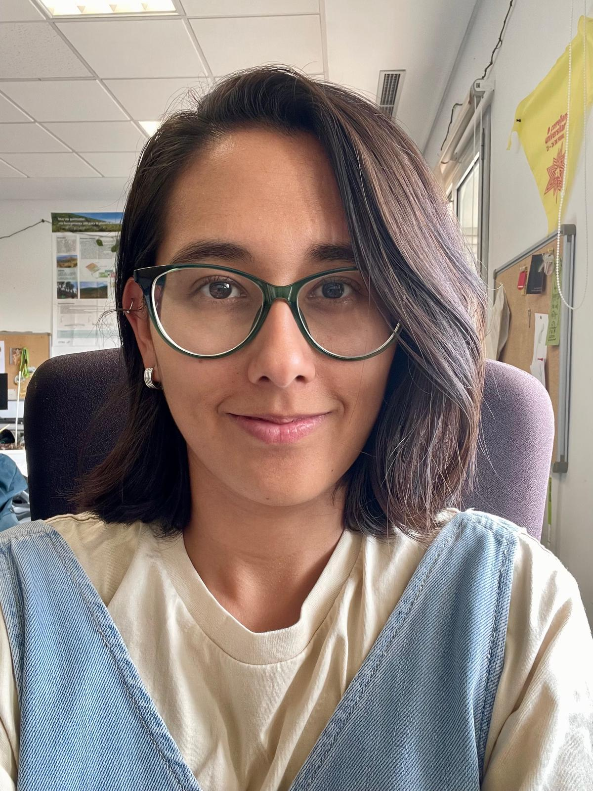

::: {.profile-pic-box}
{fig-alt="Sara Pineda Z"}
:::

## About me

Hi, I'm Sara! 👋 I'm a forestry engineer and bird enthusiast 🐦‍⬛.

I created this website to share the ups and downs of my research career, along with my own tutorials and tips on landscape ecology and landscape connectivity.

There is also a corner for [birds](birds.qmd): birdwatching and bird ringing are two of my favorite hobbies, and this is where I share the birds I've seen over the years.

I also like writing so pop over to my [blog](blog.qmd) for my thoughts on the things close to my heart: immigration, feminism 💪🏽, bird ringing, and whatever else is on my mind. ✍️

**News:** I just got my PhD diploma 🎓 and I'm about to start a postdoc in Canada 🍁, modeling forest management strategies to enhance resilience and connectivity.

### Follow me

[LinkedIn](https://www.linkedin.com/in/sara-pineda-zapata/) · [GitHub](https://github.com/spinedaz) · [Bluesky](https://bsky.app/profile/spinedaz.bsky.social)

## Recent posts

