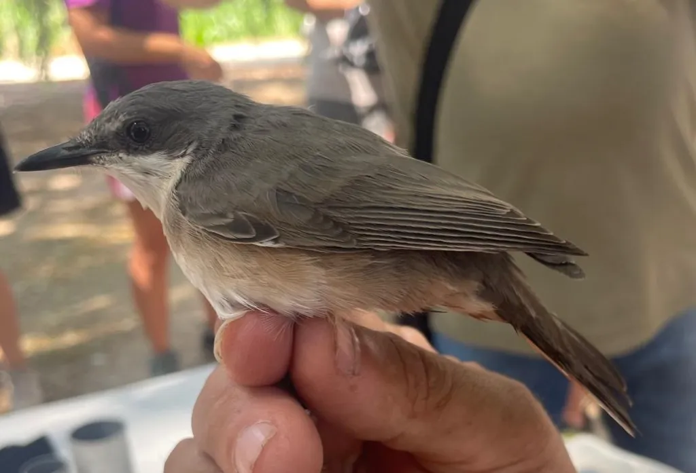
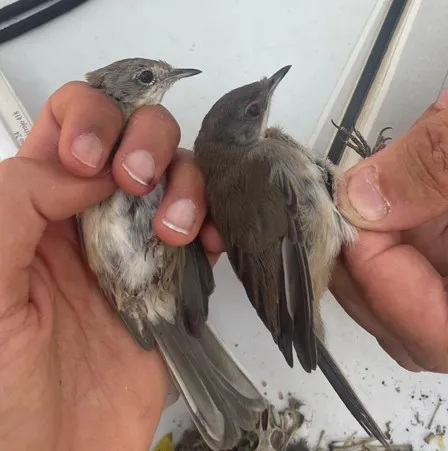
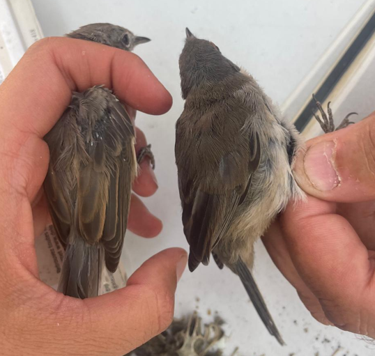
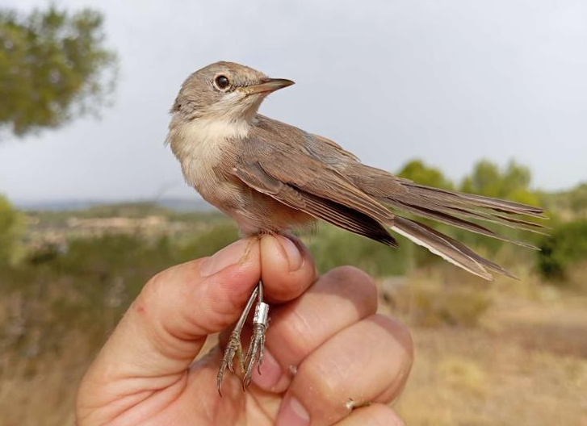

⚠️Disclaimer: Todas las fotos y la manipulación de las especies se hicieron con anilladores expertos en el marco de una sesión pedagógica de anillamiento científico.

En el último anillamiento que hicimos con Espais Naturals de Ponent en Castellserá, encontramos 3 especies de currucas muy interesantes. Antes pensaba que era bastante fácil identificarlas y no confundirlas, pero en esta época de juveniles, todo es posible y me hice un enredo cuando abrí mi guía y me di cuenta de que hay varias especies posibles y que los juveniles se ven muy diferentes a los adultos.

Los anilladores expertos de la sesión (Sergi Sales y Enric Morera) nos dieron varias claves para identificarlas y, además, encontré un par de recursos muy buenos para cuando haya dudas.

Aquí dejo un resumen de los caracteres que me parecieron más útiles para la identificación que espero les sirva a otros y que seguro yo misma visitaré en el futuro para volver a aclarar dudas.

### ***Sylvia hortensis*** – Tallarol enmascarat – Curruca mirlona

El tamaño la delata; es un ave bastante grande, con el pico más largo y duro que las demás especies. Los adultos tienen iris de color amarillento y los jóvenes iris de color oscuro

Los adultos definitivamente hacen honor a su nombre en catalán, porque llevan una máscara negra, pero no es tan claro en los juveniles, como el de esta foto:

{width=50%}

### ***Sylvia cantillans*** – Tallarol de garriga – Curruca carrasqueña vs ***Sylvia melanocephala*** – Tallarol capnegre – Curruca cabecinegra

En estas fotos comparamos dos ejemplares, a la izquierda, Sylvia cantillans joven, con un anillo ocular pálido. Los machos adultos tienen un anillo ocular rojo bastante claro y una bigotera blanca delgada. A la derecha, el juvenil de *Sylvia melanocephala* ya comienza a presentar su característico anillo ocular rojo.

{width=40%}

Otro carácter determinante es el rojizo o marrón rojizo en los bordes de las terciarias de la *Sylvia cantillans* comparada con los bordes mucho más oscuros de la Sylvia melanocephala. Esto se ve claro en la siguiente foto, pero se ve mucho más claro en esta entrada del blog del grupo de anilamiento álula donde las comparan con una tercera curruca que es la tomillera (*Sylvia conspicillata*).

{width=40%}

Finalmente, otro recurso muy útil es esta clave de Javier Blasco Zumeta y Gerd-Michael Heinze para la identificación de juveniles de curruca. Ahí, se menciona otro carácter fácil e interesante en el que, generalmente la primera primaria (en la guía 10ª) es de la misma longitud que las cobertoras primarias para la Sylvia cantillans, mientras que es más larga para la *Sylvia melanocephala.*

Aquí dejo también una foto de un juvenil de *Sylvia cantillans* tomada por Eladi Ribes en el Parapeu (Bovera, Lleida).

{width=50%}
