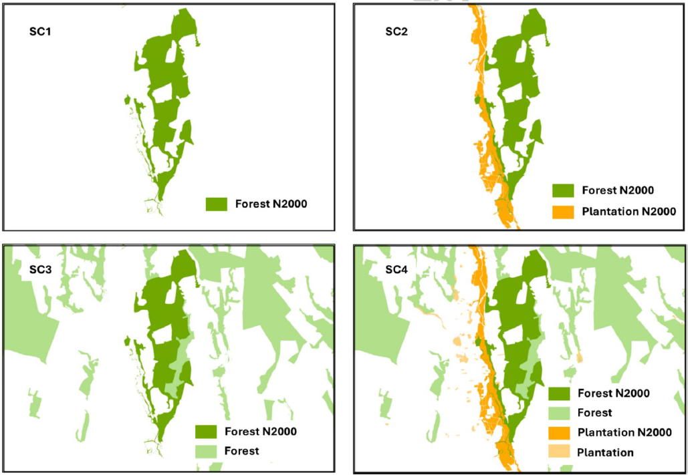
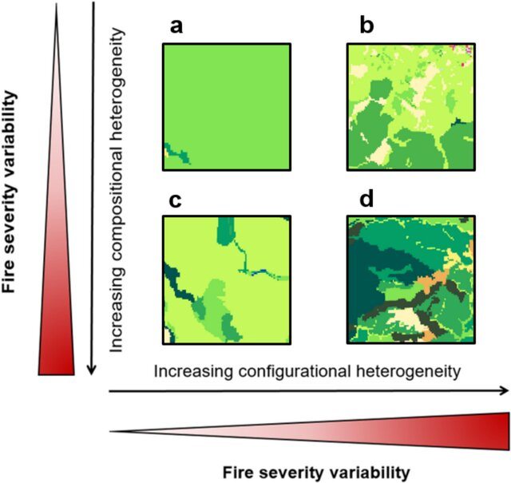
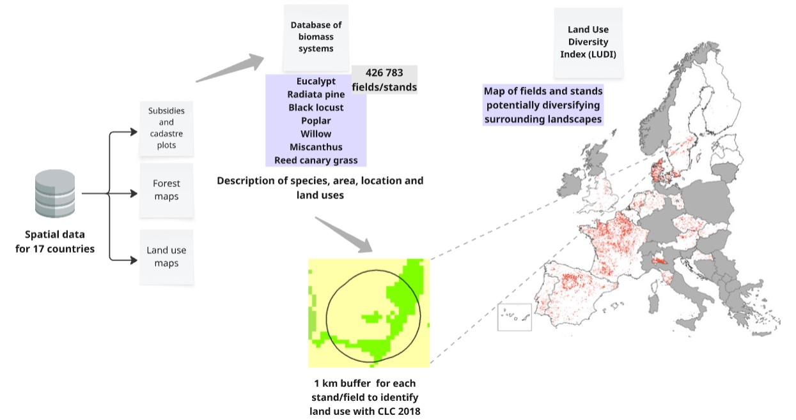
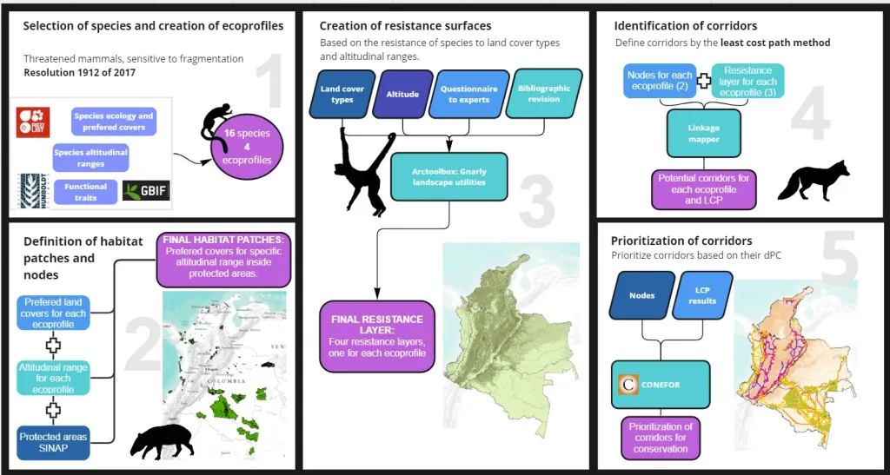

## Peer-reviewed articles

- Pineda-Zapata, S., Morán-Ordoñez, A., Mola-Yudego, B., Duflot, R. Strategic placement of plantations enhances forest connectivity for birds in agricultural landscapes. Landsc Ecol (2026). https://doi.org/10.1007/s10980-026-02316-z

{fig-align="center" width=60%}

- Blanco-Rodriguez MA, Ameztegui A, Alday JG, Lecina-Díaz J, Pineda-Zapata S, Coll L (2025). Fire severity shapes landscape heterogeneity in Mediterranean forest ecosystems. Landsc Ecol 40, 210. https://doi.org/10.1007/s10980-025-02198-7

{fig-align="center" width=60%}

- Pineda-Zapata, S., and B. Mola-Yudego. 2025. “ European Biomass Production Systems: Characterization and Potential Contribution to Land Use Diversity.” GCB Bioenergy 17, no. 7: e70057. https://doi.org/10.1111/gcbb.70057

{fig-align="center" width=60%}

- Ryzhkova, N., Asselin, H., Ali, A. A., Kryshen, A., Bergeron, Y., Robles, D., Pineda-Zapata, S., & Drobyshev, I. (2025). PDO dynamics shape the fire regime of boreal subarctic landscapes in the Northwest Territories, Canada. Journal of Geophysical Research: Biogeosciences, 130(3), e2024JG008178. https://doi.org/10.1029/2024JG008178

- Pineda-Zapata, S., González-Ávila, S., Armenteras, D., González-Delgado, T., Morán-Ordóñez, A. (2024). Mapping the way: identifying priority potential corridors for protected areas connectivity in Colombia, Perspectives in Ecology and Conservation, Volume 22, Issue 2, Pages 156-166, ISSN 2530-0644, https://doi.org/10.1016/j.pecon.2024.02.003

{fig-align="center" width=60%}